# 手写输入法项目文档

## 1. 项目概述

本项目是一个基于Qt和Windows Ink API开发的手写输入法应用程序，支持中文单字多字手写识别、非中文输入、中文输入联想等多种功能。该应用程序采用模块化设计，具有良好的可扩展性和用户体验。

### 1.1 完成情况
- [x] **单字识别输入**

  识别功能

  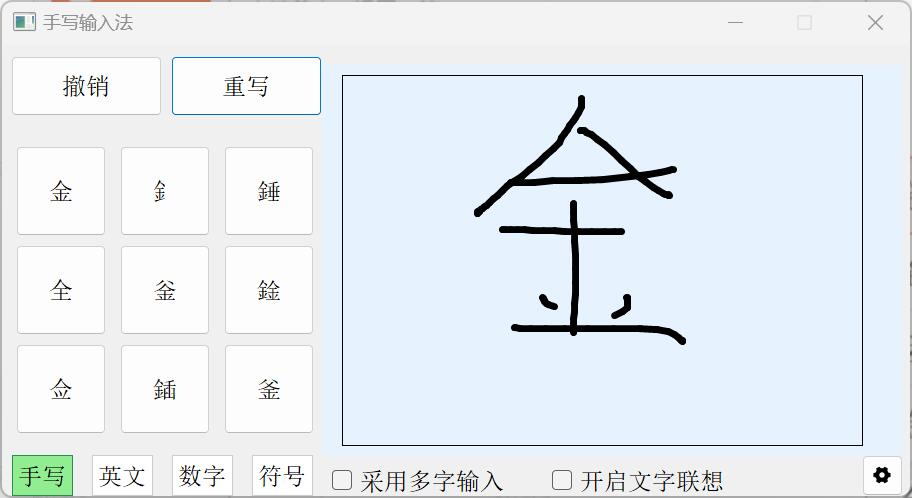

  撤销功能

  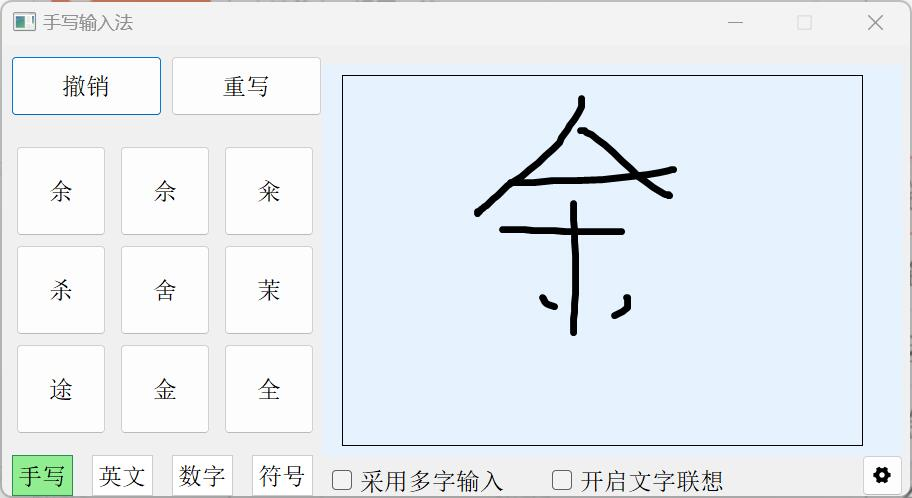

- [x] **非中文输入**

  非中文输入的三个界面

  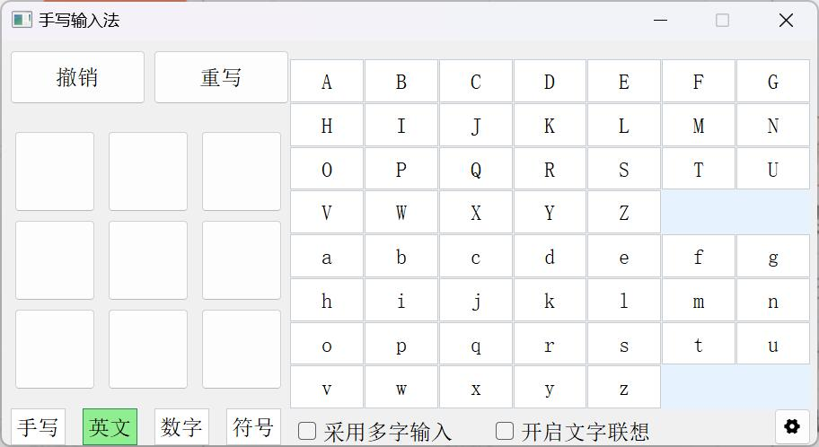

  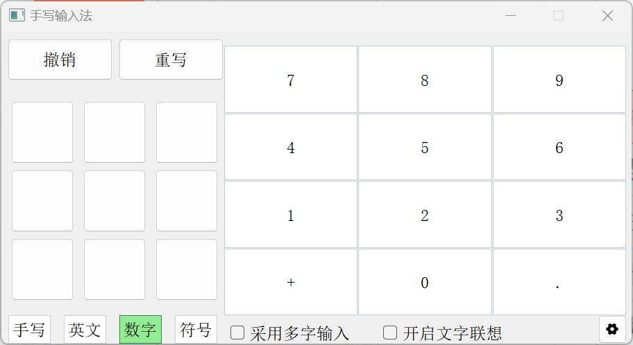

  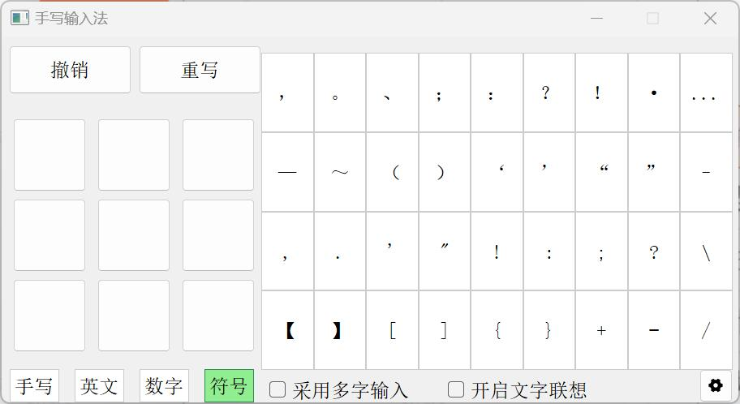

- [x] **个性化设置**

  右下角齿轮为设置入口，可以设置字体大小（下拉框小中大），五种颜色（点击颜色块即可选中），调节笔画粗细（拖动滚动条），可以保存退出，也可以不保存直接叉掉，支持恢复默认值。

  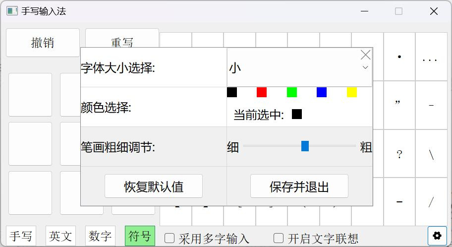

- [x] **长句手写输入**

  勾选多字输入选项后即可进行长句输入

  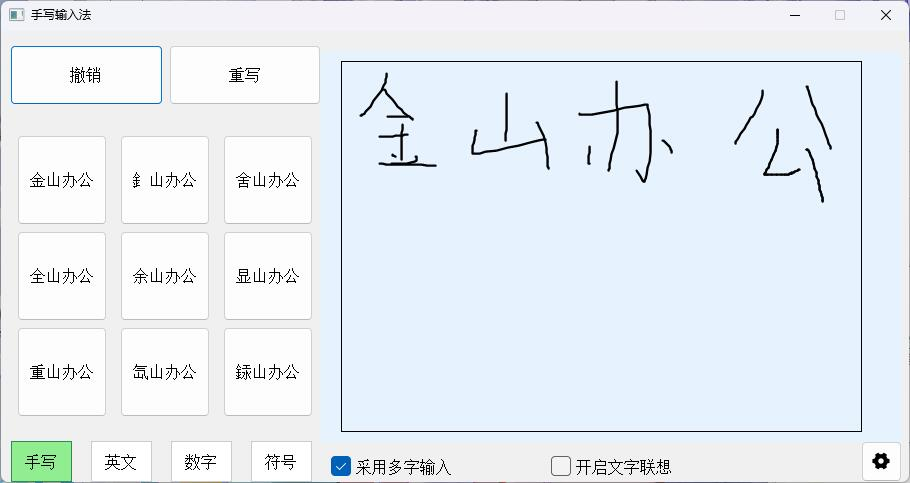

- [x] **中文联想**

  勾选中文联想后可以获得联想字，同时支持添加词语和更新频率

  可以看到我选中金后，旁边出现了可选的联想词

  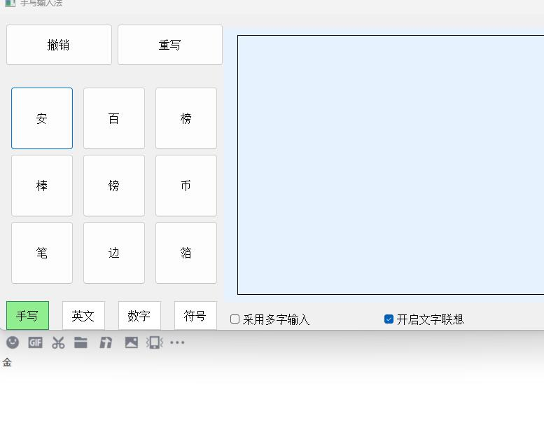

  当我输入金山后，再写“金“，下一次的联想字出现了山，说明添加成功或者更新频率成功

  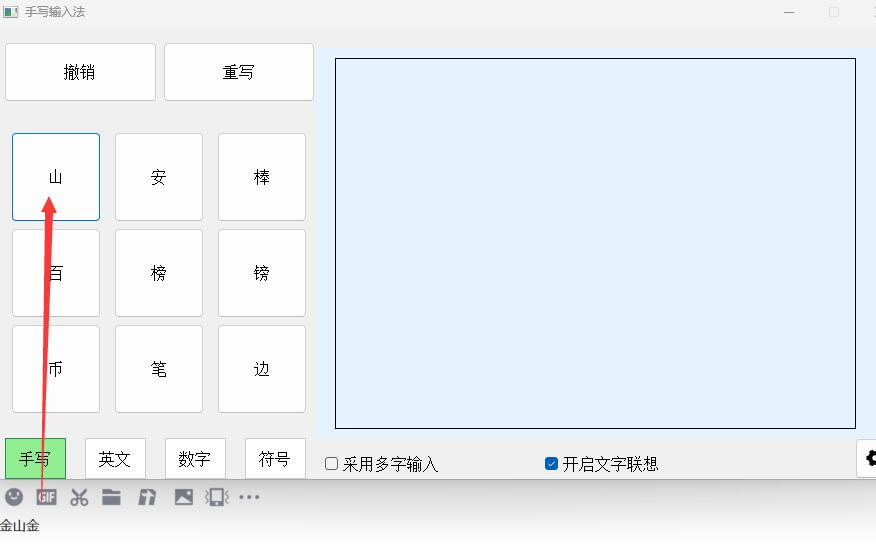

- [x] **中英文混合输入**

  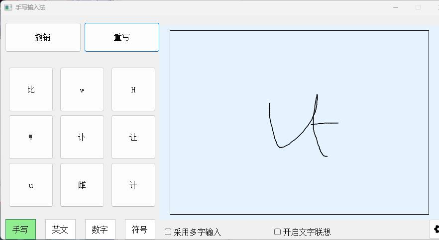


- [ ] 中文手写叠加输入

  这个没有实现，一个是我确实做不过来了（太菜了效率太低了），然后主要原因是我觉得这个功能没太大意义，也有多字输入，没必要叠写吧23333

### 1.2 技术栈
- 开发框架：Qt
- 手写识别：Windows Ink API
- 数据存储：SQLite
- 编程语言：C++


### 1.3 使用方法

1.安装Tablet_PC_SDK（Windows系统可能自带，可以先直接运行试一试）。

2.直接编译或者运行exe文件即可。


## 2. 系统设计方案

### 2.1 整体架构
项目采用模块化设计，主要包含以下几个核心模块：

1. **主窗口模块(MainWindow)**
   - 负责整体UI布局和用户交互
   - 管理各个功能页面的切换（手写页面、英文输入页面、数字输入页面、符号输入页面）
   - 处理按键事件和用户输入
   - 与其他程序通信，输出结果
2. **手写输入模块(HandsInput)**
   - 封装Windows Ink API接口
   - 处理手写识别核心功能
   - 管理墨迹收集和识别结果
3. **联想词模块(InputSuggestion)**
   - 管理词库数据
   - 提供添加新词和更新词频率的功能
   - 支持联想
4. **设置模块（setting）**
   - 管理用户偏好设置，可恢复默认
   - 提供字体、颜色、笔画粗细等调整功能

### 2.2 数据流设计
```
用户输入 -> 手写识别-> 文字处理 -> 联想词推荐（maybe） -> 输出到目标窗口
```


## 3. 核心功能代码解析

### 3.1 手写识别实现
```cpp
void handsInput::ProcessInkData(std::vector<InputResult>& ResultsContainer)
{
    // 清空现有结果
    ResultsContainer.clear();

    // 获取墨迹快照
    IInkStrokes* pInkStrokesSnapshot = nullptr;
    HRESULT hr = g_pIInkDisp->get_Strokes(&pInkStrokesSnapshot);
    if (SUCCEEDED(hr))
    {
        // 设置识别器的笔触源
        hr = g_pIInkRecoContext->putref_Strokes(pInkStrokesSnapshot);
        if (SUCCEEDED(hr))
        {
            // 执行识别过程
            IInkRecognitionResult* pRecognitionOutcome = nullptr;
            InkRecognitionStatus status = IRS_NoError;
            hr = g_pIInkRecoContext->Recognize(&status, &pRecognitionOutcome);
            if (SUCCEEDED(hr) && pRecognitionOutcome != nullptr)
            {
                // 获取识别的备选结果
                IInkRecognitionAlternates* pAlternates = nullptr;
                hr = pRecognitionOutcome->AlternatesFromSelection(0, -1, 10, &pAlternates);
                long alternateCount = 0;
                if (SUCCEEDED(hr) && pAlternates->get_Count(&alternateCount) == S_OK)
                {
                    // 遍历并存储备选结果
                    for (LONG index = 0; index < alternateCount && index < 10; ++index)
                    {
                        IInkRecognitionAlternate* pCurrentAlternate = nullptr;
                        if (pAlternates->Item(index, &pCurrentAlternate) == S_OK)
                        {
                            BSTR recognitionString = nullptr;
                            if (pCurrentAlternate->get_String(&recognitionString) == S_OK)
                            {
                                InputResult tempRlt = { 0 };
                                QString str = QString::fromWCharArray(recognitionString);
                                strncpy(tempRlt.result, str.toUtf8().data(), sizeof(tempRlt.result) - 1);
                                ResultsContainer.push_back(tempRlt);
                            }
                            pCurrentAlternate->Release();
                        }
                    }
                }
            }
            // 重置识别器笔触源
            g_pIInkRecoContext->putref_Strokes(nullptr);
        }
        pInkStrokesSnapshot->Release();
    }
}
```
关键点解释：
- 使用Windows Ink API进行手写识别
- 支持9个候选结果返回
- 实时识别和反馈

### 3.2 联想词实现
```cpp
QVector<QString> InputSuggestion::getSuggestions(const QString& input, int maxResults) {
    QVector<QString> suggestions;

    if (input.isEmpty() || !m_db.isOpen()) {
        return suggestions;
    }

    QSqlQuery query(m_db);
    query.prepare(
        "SELECT word FROM dictionary "
        "WHERE word LIKE :pattern "
        "ORDER BY LENGTH(word) ASC, frequency DESC, last_used DESC " // 按字数升序，然后是频率和最后使用时间降序
        "LIMIT :limit"
    );
    query.bindValue(":pattern", input + "%");
    query.bindValue(":limit", maxResults);

    if (query.exec()) {
        while (query.next()) {
            suggestions.append(query.value(0).toString());
        }
    }
    return suggestions;
}

bool InputSuggestion::addWord(const QString& word, int frequency) {
    QSqlQuery query(m_db);
    query.prepare(
        "INSERT OR REPLACE INTO dictionary (word, frequency) "
        "VALUES (:word, :frequency)"
    );

    query.bindValue(":word", word);
    query.bindValue(":frequency", frequency);

    return query.exec();
}

bool InputSuggestion::updateFrequency(const QString& word) {
    QSqlQuery query(m_db);
    query.prepare(
        "UPDATE dictionary "
        "SET frequency = frequency + 1, "
        "last_used = CURRENT_TIMESTAMP "
        "WHERE word = :word"
    );

    query.bindValue(":word", word);

    return query.exec();
}
```
关键点解释：
- 使用SQLite存储词库，词库初始化使用搜狗输入法开源的标准词库
- 基于词频和使用时间排序（最开始按长度排序是因为暂时频率和使用时间都一致，会出现很多乱七八糟的东西，干脆先专注**一个字和一个字之间的联想**）
- 支持动态更新词频，可以根据用户选择添加新词和增加词的评率


### 3.3 不同进程之间通讯的实现

```cpp
//虚拟键盘发送字符
void MainWindow::SendKeys(HWND hwnd, const std::wstring& text)
{
    for (wchar_t ch : text) {
        // 发送WM_CHAR消息，模拟字符输入
        SendMessageW(hwnd, WM_CHAR, ch, 0);
    }
}
```

关键点解释：

- 使用虚拟键盘，根据获得的窗口ID注入消息
- 曾经尝试了3天TSF框架来实现消息注入，但是可能是系统问题或者对Windows底层API不够熟悉，最后总是获取不到窗口的文档管理器，创建再绑定也失败，还不知道后面会出什么幺蛾子，遂放弃


### 3.4 UI实现

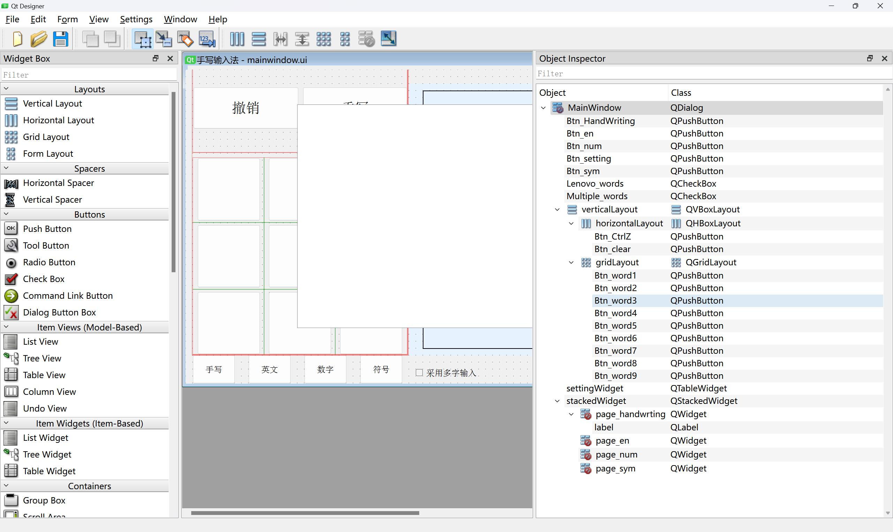

关键点解释：

- 最开始搭建UI的时候一个一个老老实实地搭，采用stackedWidget来进行四个输入页面的切换。
- 到英文界面受不了了，56个按键，选择动态生成，开始用循环来生成按键和绑定槽函数，后面也是这样，具体详见源代码。
- 设置页面采用tablewidget，上面的选项也都是动态生成的

## 4. 项目亮点

### 4.1 技术创新
1. **高效的手写识别算法**
   - 集成Windows Ink API，提供准确的识别效果
   - 支持单字和多字两种识别模式，以及混合识别
   - 实现笔画实时预览和识别

2. **智能的联想词系统**
   - 基于词频和时间的智能排序
   - 支持自学习功能，根据用户使用习惯优化推荐
   - 高效的SQLite数据存储和查询优化

3. **模块化设计**
   - 清晰的代码结构，便于维护和扩展
   - 各功能模块高内聚低耦合
   - 尽量把可能出错的地方都加入了错误处理机制

### 4.2 用户体验优化
1. **联想功能和多字识别选择开启**

   - 开启这两个功能可能会略微影响到正常使用，给定开关
   - 联想功能会随着使用逐渐个性化

2. **操作便捷性**

   - 快速切换输入模式
   - 撤销/重做功能
   - 置顶显示功能，外部程序不会被写字板抢占焦点

3. **错误提示及处理**

   - 如未安装SDK会提醒并退出程序

   - 如数据库初始化失败会自动关闭联想功能防止崩溃

## 5. 测试方案

### 5.1 单元测试
- **手写识别测试**
  - 测试单字识别功能（√）
  - 测试多字识别功能（√）
  - 测试混合输入识别（√）
- **联想词测试**
  - 测试词库查询性能（√）
  - 测试词频更新机制（√）
  - 测试自学习效果（√）
- **通信测试**
  - 手写识别到各个进程的输入测试（**存在小问题**，详细见下）

### 5.2 集成测试
- **跨模块测试**
  - 手写识别到联想词的流程测试（√）
  - 设置更改对各模块的影响测试，保存与否及更改效果（√）

### 5.3 用户界面测试
- **功能测试**
  - 所有按钮和控件的功能验证（√）
  - 页面切换的正确性验证（√）
  - 输入法显示和隐藏测试（√）
- **兼容性测试**
  - 不同主机测试（√）
  - 不同分辨率下的显示测试（√）
  - 分辨率不变缩放情况（**存在小问题**，详细见下）


## 6. 不足之处&未来展望

### 6.1 发现但是没有解决的问题
- 画板上的笔迹可能会因为外部程序应用的某些操作突然不见，但是实际上还存在，并且还有可能显示回来（？）。触发条件未知，复现不出来，解决不了一点，对调用的库可能的bug一无所知
- 联想词会有一定的卡顿，可能是查询写的太简单了，性能不够好，但是我也不知道怎么优化，数据库有点大
- 在不同分辨率下没什么问题，但是分辨率固定的时候缩放可能会出现文字太大超出显示范围的情况，这个时候可以把字体调小一点（bushi）。因为我不知道怎么同时动态更新组件和窗口大小，直接给固定死了防止组件到窗口外边去了。
- 使用虚拟键盘无法输入到部分进程，经测试，目前只知道Windows的记事本无法通讯，浏览器、IDE、QQ等聊天软件都支持

### 6.2 想拓展的功能
- 优化联想查询速度（卡顿明显）
- 改进联想词算法（目前这个功能只能说有，还是有一点鸡肋）
- 美化UI（随手搭的真的太丑了）
- 实现TSF（这个真给我折磨坏了，只能退而求其次了）


## 7. 总（tu）结（cao）

期末月做的，还好大三考试比较少，算是抽出了一个多星期的空档来做，实现基础功能后然后被tsf折磨了三天，无从下手，比较幸运的是找到了一个开源的项目借鉴了一下手写识别部分，剩下的赶工来得及，我现在赶工完还得赶紧去赶课内DDL和复习下一门考试QAQ


平心而论我自己对这次作业还算满意，在最开始看到结课作业的时候内心有一点点崩溃，当时qt只上了一节课吧，一点不会。现在一步步做下来，从看写好的项目到自己写项目，再到不断的测试、完善，多多少少能看到自己的进步。虽然还是在写屎山，但是现在写的是稍微整齐一点的屎山。AI也帮了很多，很多不清楚的地方都是询问AI了解到有点难搜到的细节，然后解决的问题。虽然这么做根基有点不扎实，但动手能力还是提升了，其他的也可以慢慢补（应该吧）。

现在回过头来看这个项目，清晰无比啊，各个模块都是堆料和调库，貌似也没什么难的，而且开发的也是有点欠缺经验，比如UI的构造，一开始一个个往上加，受不了了才想到动态生成，然后效率才上来（虽然动态生成也有点不好的地方就是了）。

经验的缺乏可能也导致了我的测试流程不规范，调试困难加大等等，还有bug没修完，但是不是特别影响程序，就先放这吧，实在修不动了。


exe有点大，主要是塞了个数据库。

熬了好几天夜了，现在也还在熬夜写文档，好累啊。

